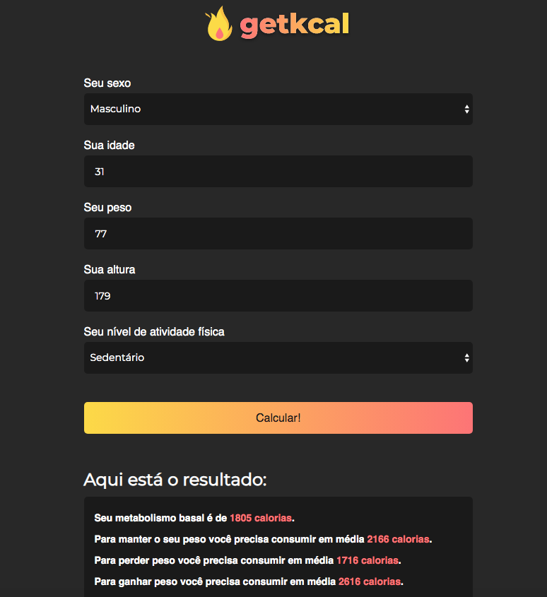

# getkcal-js
Aplicação que realiza o cálculo da [Taxa Metabolica Basal](http://www.brdanutricao.com.br/calculadora-taxa-metabolica-basal/ ).
Desenvolvida utilizando apenas HTML, CSS e JavaScript puro, seguindo as orientações do [Mateus Silva](https://github.com/maateusilva) neste vídeo: 
[https://www.youtube.com/watch?v=yiDq9wUiUjc](https://www.youtube.com/watch?v=yiDq9wUiUjc) 

Este é o visual da aplicação:


Estes são os arquivos iniciais do projeto **getkcal** disponível no YouTube.

## Instalação

Este projeto não precisa de nenhuma depedência para funcionar, porém durante a aula iremos utilizar o pacote `serve` para roda-lo no browser através de um servidor node.

Sinta-se a vontade caso queira rodar este projeto direto no seu browser clicando com o botão direito no arquivo `index.html` e, em seguida, selecionando a opção `Abrir Com` e selecionando o navegador de sua preferência.

Você precisará ter o [NodeJS](https://nodejs.org) instalado na sua máquina, e, após isso, clonar este repositório:
```sh
  $ git clone https://github.com/maateusilva/getkcal.git
```

## Executando a aplicação

Para executá-la é muito simples, basta rodar os seguintes comandos:
```sh
  $ cd getkcal/starterkit # para acessar a pasta clonada do git
  $ npm init -y # inicializando o package.json
  $ npm install serve -D # instalando o serve como dependência de desenvolvimento
  $ npx serve . # rodando o servidor node
```